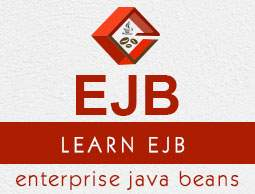

# template-ejb
<h1 align="center">
   
  
   
  </h1>
A brief tutorial about JEE(Part 1 EJB).

### Getting Started
  <h1 align="center" > </h1>
  

  
**EJB** :Enterprise Java Beans (EJB) is a development architecture for building highly scalable and robust enterprise level applications to be deployed on J2EE compliant Application Server such as JBOSS, Web Logic etc. EJB 3.0 is being a great shift from EJB 2.0 and makes development of EJB based applications quite easy. This tutorial is developed to provide a comprehensive understanding about the EJB concepts helpful to create and deploy an enterprise level application up and running.

 

## Built With

* [Maven](https://maven.apache.org/) - Dependency Management
* [EJB](https://www.tutorialspoint.com/ejb/) 

## Authors

* **Aymanov** - *Initial work* - [Aymanov1](https://github.com/Aymanov1)